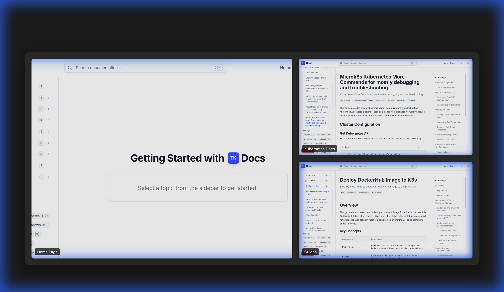

# TK Docs

<div align="center">



**A modern, high-performance documentation platform built with Next.js 16 and MDX**

[](https://nextjs.org/)
[](https://react.dev/)
[](https://www.typescriptlang.org/)
[](https://tailwindcss.com/)
[](LICENSE)

[Features](#-features) • [Quick Start](#-quick-start) • [Documentation](#-documentation) • [Project Structure](#-project-structure) • [Contributing](#-contributing)

</div>

---

## 📖 Overview

**TK Docs** is a production-ready documentation template designed for developers who need a fast, beautiful, and maintainable documentation site. Built with cutting-edge technologies, it provides an exceptional reading experience while maintaining excellent developer experience.

Perfect for technical documentation, API references, knowledge bases, and developer guides.

## ✨ Features

### 🚀 Performance & Modern Stack

- **Next.js 16** with App Router for optimal performance
- **React 19** with Server Components
- **TypeScript** for type safety
- **Tailwind CSS 4** for modern styling
- **pnpm** for fast, efficient package management

### 📝 Content Management

- **MDX Support** - Write docs in Markdown with React components
- **Frontmatter** - Metadata support for title, description, and tags
- **Code Highlighting** - Beautiful syntax highlighting with Prism
- **Auto-generated Sidebar** - Automatic navigation from folder structure
- **Table of Contents** - Automatic heading extraction

### 🎨 UI Components

- **30+ Pre-built Components** - Accordion, Alert, Badge, Card, Tabs, and more
- **Organized Structure** - Components organized by category (buttons, forms, modals)
- **PascalCase Naming** - React-consistent naming conventions for easy identification
- **Radix UI Primitives** - Accessible, unstyled components
- **Responsive Design** - Mobile-first approach
- **Custom Fonts** - Inter for text, JetBrains Mono for code
- **Performance Optimized** - Dynamic imports for non-critical components

### 🔍 Enhanced UX

- **Command Palette** - Quick search with `Cmd+K` / `Ctrl+K`
- **SEO Optimized** - Meta tags, OpenGraph, Twitter cards
- **Security Headers** - HSTS, CSP, X-Frame-Options configured
- **Sitemap Generation** - Automatic sitemap for better indexing

### 🛠️ Developer Experience

- **Hot Reload** - Instant feedback during development
- **ESLint** - Code quality checks
- **TypeScript Strict Mode** - Maximum type safety
- **Component Examples** - [View all available components](/content/component-examples.mdx)

## 🚀 Quick Start

### Prerequisites

- **Node.js** 18.17 or higher
- **pnpm** (recommended) or npm/yarn

### Installation

1. **Use this template or clone:**

   ```bash
   git clone https://github.com/dedkola/tk-docs.git
   cd tk-docs
   ```

2. **Install dependencies:**

   ```bash
   pnpm install
   ```

3. **Start the development server:**

   ```bash
   pnpm dev
   ```

4. **Open your browser:**

   Navigate to [http://localhost:3000](http://localhost:3000)

### Build for Production

```bash
pnpm build
pnpm start
```

## 📚 Documentation

### Creating Your First Page

The template includes one example file: `component-examples.mdx` showing all available components.

**To add your own content:**

1. Create a new `.mdx` file in the `content/` directory (or in a subfolder):

````mdx
---
title: Getting Started
description: Learn how to use TK Docs
tags: [guide, beginner]
---

# Getting Started

Welcome to your documentation site!

## Installation

Install the package:

```bash
npm install your-package
```

<Alert>
  <AlertTitle>Note</AlertTitle>
  <AlertDescription>
    This is an example of using components in MDX.
  </AlertDescription>
</Alert>
````

2. The page will automatically appear in the sidebar based on the folder structure
3. Organize pages into folders for better navigation (e.g., `content/guides/getting-started.mdx`)
4. You can safely remove `component-examples.mdx` once you're familiar with the components

### Using Components

All UI components are available in MDX files. See the complete list with examples:

👉 **[View Component Examples](content/component-examples.mdx)**

````mdx
<Tabs defaultValue="npm">
  <TabsList>
    <TabsTrigger value="npm">npm</TabsTrigger>
    <TabsTrigger value="pnpm">pnpm</TabsTrigger>
  </TabsList>
  <TabsContent value="npm">```bash npm install package ```</TabsContent>
  <TabsContent value="pnpm">```bash pnpm add package ```</TabsContent>
</Tabs>
````

### Organizing Content

The `content/` folder starts with only one file:

```
content/
└── component-examples.mdx    # Component showcase & reference
```

**To add your documentation:**

1. Create folders for different sections (e.g., `guides/`, `api/`, `tutorials/`)
2. Add `.mdx` files inside these folders
3. The sidebar navigation will be auto-generated from your folder structure

**Example structure you might create:**

```
content/
├── component-examples.mdx    # Keep this as reference
├── getting-started/
│   ├── installation.mdx
│   └── quick-start.mdx
├── guides/
│   ├── authentication.mdx
│   └── deployment.mdx
└── api/
    └── reference.mdx
```

Each folder becomes a section in the sidebar, and files within become pages.

### Configuring Your Site

**Site configuration uses a 3-layer approach for smooth updates:**

We separate defaults, production overrides, and optional local changes:

- **`config/config.base.ts`** – Template defaults (do not modify)
- **`config/config.private.ts`** – Committed, production overrides (domain, analytics, socials)
- **`config/config.local.ts`** – Gitignored, dev-only overrides (optional)
- **`config/site.ts`** – Aggregator that merges Base → Private → Local

This keeps updates simple and hosting predictable, with zero surprises.

#### Quick Configuration

1. **Copy the example local file** (optional, for dev):

```bash
cp config/config.local.example.ts config/config.local.ts
```

2. **Edit `config/config.private.ts`** for production settings, and `config/config.local.ts` for dev-only overrides:

```typescript
import type { BaseSiteConfig } from "./config.base";

export const privateConfig: Partial<BaseSiteConfig> = {
  // Basic Information
  name: "Your Site Name",
  title: "Your Site Title",
  description: "Your site description",
  url: "https://yourdomain.com",

  // Social Media Links (set to empty string "" to hide)
  social: {
    github: "https://github.com/yourusername",
    twitter: "https://twitter.com/yourusername",
    linkedin: "https://linkedin.com/in/yourusername",
  },

  // Twitter/X Card Configuration
  twitter: {
    card: "summary_large_image",
    creator: "@yourtwitterhandle",
  },

  // Open Graph Image (for social sharing)
  og: {
    image: "/og-image.png",
    imageWidth: 1200,
    imageHeight: 630,
  },

  // Google Analytics
  analytics: {
    googleAnalyticsId: "G-XXXXXXXXXX", // Add your GA4 ID
  },

  // Footer Branding
  footer: {
    companyName: "YourCompany",
  },
};
```

> **Note:** You only need to specify fields you want to override. Unspecified fields use defaults from `config.base.ts`. Dev-only changes go in `config.local.ts`.

#### Why This Approach?

- **Clean separation** - Base defaults stay intact, your changes are isolated
- **Easy updates** - Update the template without losing your customizations
- **Type safety** - TypeScript ensures your overrides match the base config
- **Git-friendly** - `config.local.ts` is gitignored; `config.private.ts` is committed for predictable hosting

#### Configuration Fields Explained

| Field             | Purpose                             | Example                             |
| ----------------- | ----------------------------------- | ----------------------------------- |
| `name`            | Company/site name                   | `"TK Docs"`                         |
| `title`           | Page title (appears in browser tab) | `"TK Docs"`                         |
| `description`     | Meta description (SEO)              | `"A modern documentation platform"` |
| `url`             | Your production domain              | `"https://docs.example.com"`        |
| `social.github`   | GitHub profile link                 | Leave empty `""` to hide            |
| `social.twitter`  | Twitter profile link                | Leave empty `""` to hide            |
| `social.linkedin` | LinkedIn profile link               | Leave empty `""` to hide            |
| `twitter.creator` | Twitter handle for cards            | `"@yourhandle"`                     |
| `og.image`        | Social sharing image                | Must be in `/public` folder         |

#### What Changes When You Update Config

✅ **Site title** - Browser tab, metadata, social cards  
✅ **Site description** - Meta tags, SEO, social sharing  
✅ **Social links** - Header and footer links  
✅ **Sitemap & Robots** - Generated with your domain  
✅ **Footer text** - Company name in copyright  
✅ **OG Image** - Used when shared on social media

> **💡 Tip:** After updating `config/config.private.ts` or `config/config.local.ts`, restart your dev server for changes to take effect.

#### Example: White-Label for a Client

Edit `config/config.private.ts` with client-specific overrides:

```typescript
import type { BaseSiteConfig } from "./config.base";

export const privateConfig: Partial<BaseSiteConfig> = {
  name: "Client Inc",
  title: "Client Inc Documentation",
  description: "Official documentation for Client Inc products",
  url: "https://docs.clientinc.com",

  social: {
    github: "https://github.com/clientinc",
    twitter: "https://twitter.com/clientinc",
    linkedin: "https://linkedin.com/company/clientinc",
  },

  twitter: {
    card: "summary_large_image",
    creator: "@clientinc",
  },

  og: {
    image: "/og-image.png",
  },

  footer: {
    companyName: "Client Inc",
  },
} as const;
```

That's it! All branding updates instantly across the entire site.

#### Analytics (Google Analytics)

Add your GA4 Measurement ID in `config/config.private.ts` (production) or leave empty in `config/config.local.ts` (dev):

```typescript
export const privateConfig: Partial<BaseSiteConfig> = {
  // ... other config
  analytics: {
    googleAnalyticsId: "G-XXXXXXXXXX", // Replace with your GA4 ID
  },
};
```

- The ID is read by `components/analytics.tsx` and injected globally from `app/layout.tsx`
- Leave `googleAnalyticsId` empty to disable Google Analytics automatically
- Restart dev server or redeploy after updating the ID

## 📁 Project Structure

```
tk-docs/
├── app/                          # Next.js App Router
│   ├── layout.tsx               # Root layout with sidebar & dynamic imports
│   ├── page.tsx                 # Homepage
│   ├── globals.css              # Global styles
│   ├── code-highlight.css       # Syntax highlighting styles
│   ├── docs/
│   │   └── [...slug]/           # Dynamic MDX routes
│   └── ui/
│       ├── search.tsx           # Search component
│       └── interface/           # Layout components
├── components/                   # React components
│   ├── mdx/
│   │   └── code-block.tsx       # Code block component
│   ├── ui/                      # Radix UI components (PascalCase)
│   │   ├── buttons/             # Button-related components
│   │   ├── forms/               # Form-related components
│   │   ├── modals/              # Modal & dialog components
│   │   ├── Accordion.tsx
│   │   ├── Alert.tsx
│   │   ├── Badge.tsx
│   │   ├── Button.tsx
│   │   ├── Card.tsx
│   │   ├── Tabs.tsx
│   │   ├── README.md            # Component documentation
│   │   └── ... (30+ components)
│   ├── analytics.tsx            # Analytics (dynamically loaded)
│   ├── header.tsx               # Site header
│   ├── footer.tsx               # Site footer (dynamically loaded)
│   ├── TableOfContents.tsx      # TOC component
│   └── ShareButtons.tsx         # Social sharing
├── config/                       # Configuration files
│   ├── config.base.ts           # Base configuration (template defaults)
│   ├── config.private.ts        # Production overrides (committed)
│   ├── config.local.example.ts  # Example dev overrides (copy to config.local.ts)
│   └── site.ts                  # Aggregator that merges all configs
├── content/                      # MDX documentation files
│   └── component-examples.mdx   # Component showcase (reference)
├── hooks/                        # Custom React hooks
│   ├── use-mobile.ts
│   └── use-toast.ts
├── lib/                          # Utility functions
│   ├── mdx-utils.ts             # MDX parsing utilities
│   ├── extract-headings.ts      # TOC extraction
│   └── utils.ts                 # General utilities
├── public/                       # Static assets
│   ├── robots.txt
│   └── assets/
├── types/                        # TypeScript definitions
├── next.config.mjs              # Next.js configuration
├── tailwind.config.ts           # Tailwind configuration
├── tsconfig.json                # TypeScript configuration
└── package.json                 # Dependencies & scripts
```

## 🛠 Tech Stack

| Technology                                                  | Purpose                         |
| ----------------------------------------------------------- | ------------------------------- |
| [Next.js 16](https://nextjs.org/)                           | React framework with App Router |
| [React 19](https://react.dev/)                              | UI library                      |
| [TypeScript](https://www.typescriptlang.org/)               | Type safety                     |
| [Tailwind CSS 4](https://tailwindcss.com/)                  | Utility-first CSS               |
| [MDX](https://mdxjs.com/)                                   | Markdown + JSX                  |
| [Radix UI](https://www.radix-ui.com/)                       | Accessible component primitives |
| [Lucide](https://lucide.dev/)                               | Icon library                    |
| [Prism](https://prismjs.com/)                               | Syntax highlighting             |
| [gray-matter](https://github.com/jonschlinkert/gray-matter) | Frontmatter parsing             |

## 🎨 Customization

### Quick Configuration ⚡ (Recommended)

The easiest way to customize your site is using the **three-file config system:**

👉 **Edit `config/config.private.ts`** - Production settings (domain, analytics, social links).

👉 **Copy & edit `config/config.local.ts`** (optional) - Dev-only overrides (copy from `config.local.example.ts`).

See the [Configuring Your Site](#configuring-your-site) section above for all options.

### Advanced Customization

- **Global styles:** `app/globals.css`
- **Tailwind config:** `tailwind.config.ts`
- **Code highlighting:** `app/code-highlight.css`

### Components

Add custom components in `components/` and import them in MDX files.

### Performance Optimization

The application implements performance best practices:

- **Dynamic Imports** - Non-critical components (`Footer`, `Analytics`) are dynamically imported in `app/layout.tsx`
- **Server Components** - Layout and pages use Next.js Server Components by default for better performance
- **Lazy Loading** - Components are loaded only when needed, reducing initial bundle size

**Example - Dynamic Import Pattern:**

```tsx
import dynamic from "next/dynamic";

const Footer = dynamic(() => import("@/components/footer"), {
  ssr: true,
});
```

### Importing Components

Always use the correct import path with PascalCase names:

```tsx
// ✅ Correct
import { Button } from "@/components/ui/Button";
import { Card, CardHeader, CardContent } from "@/components/ui/Card";

// ❌ Incorrect (old naming convention)
import { Button } from "@/components/ui/button";
```

### Adding New Components

When creating new UI components:

1. Place them in `components/ui/` with **PascalCase filenames**
2. Use **Radix UI** as the foundation for accessible components
3. Style with **Tailwind CSS**
4. Export from the component file and import with PascalCase naming
5. Consider organizing in subfolders (`buttons/`, `forms/`, `modals/`) based on functionality

**Example Component Structure:**

```tsx
// components/ui/Button.tsx
import * as React from "react";
import { cn } from "@/lib/utils";

interface ButtonProps extends React.ButtonHTMLAttributes<HTMLButtonElement> {
  variant?: "primary" | "secondary";
}

const Button = React.forwardRef<HTMLButtonElement, ButtonProps>(
  ({ className, variant = "primary", ...props }, ref) => (
    <button
      ref={ref}
      className={cn(
        "px-4 py-2 rounded font-medium transition-colors",
        variant === "primary" && "bg-blue-600 text-white hover:bg-blue-700",
        variant === "secondary" &&
          "bg-gray-200 text-gray-800 hover:bg-gray-300",
        className
      )}
      {...props}
    />
  )
);

Button.displayName = "Button";
export { Button };
```

### Content Guidelines

- Store all documentation in the `content/` folder
- Organize by topic in subfolders (e.g., `content/guides/`, `content/api/`)
- Use frontmatter for metadata (title, description, tags)
- Keep MDX files focused and modular

## 🤝 Contributing

Contributions are welcome! Please feel free to submit a Pull Request.

1. Fork the repository
2. Create your feature branch (`git checkout -b feature/AmazingFeature`)
3. Commit your changes (`git commit -m 'Add some AmazingFeature'`)
4. Push to the branch (`git push origin feature/AmazingFeature`)
5. Open a Pull Request

## 📄 License

This project is licensed under the MIT License - see the [LICENSE](LICENSE) file for details.

## 🙏 Acknowledgments

- [Vercel](https://vercel.com) for Next.js
- [Radix UI](https://www.radix-ui.com/) for accessible components
- [shadcn/ui](https://ui.shadcn.com/) for component inspiration

---

<div align="center">

Made with ❤️ by [dedkola](https://github.com/dedkola/)

[Documentation](https://doc.tkweb.site) • [GitHub](https://github.com/dedkola/tk-docs-template) • [Issues](https://github.com/dedkola/tk-docs-template/issues)
